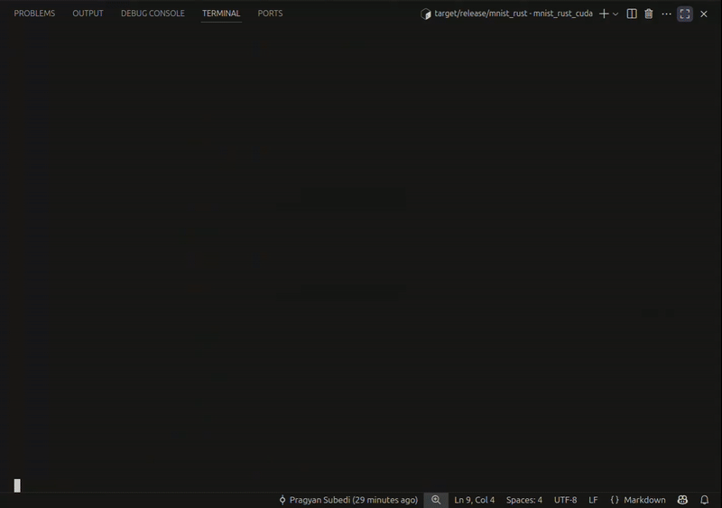

# Machine Learning In Rust

This repository houses code to get started in Machine Learning using Rust using the [Burn Book](https://burn.dev/burn-book/getting-started.html) as a reference.

Refer to the readme in each directory to get started.

## mnist_rust_cuda

Train the MNIST dataset using CUDA.

